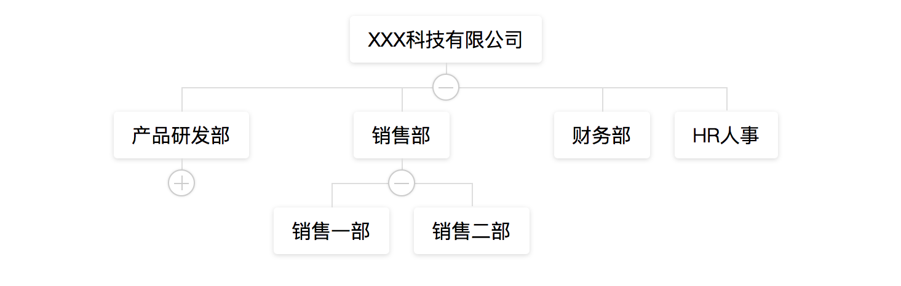
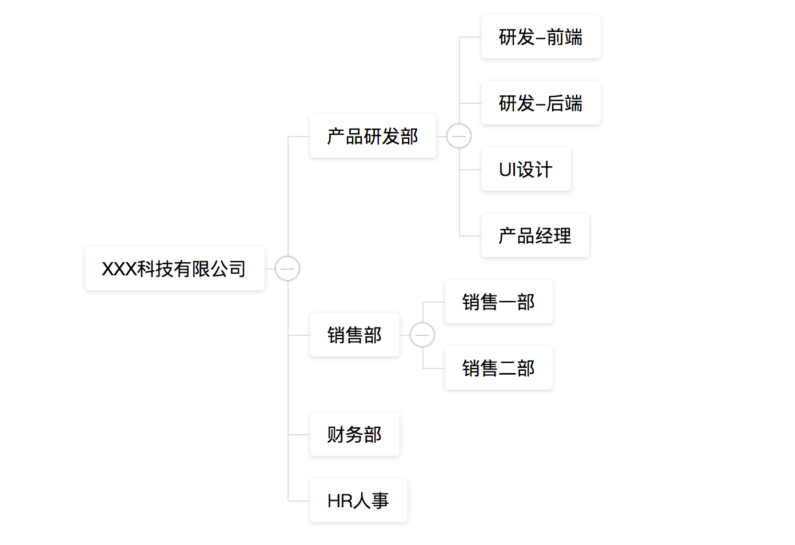

# vue-org-tree

> A simple organization tree chart based on Vue2.x

## Usage

### NPM

```
# use npm
npm i @orez/vue2-org-tree

# use yarn
yarn add @orez/vue2-org-tree
```
### Import Plugins

``` js
import Vue from 'vue'
import OrgTree from '@orez/vue-org-tree'
import '@orez/vue-org-tree/style.css'

Vue.use(OrgTree)

// ...
```

## API

#### props

  prop              | descripton                              | type                   | default
  ------------------|-----------------------------------------|:----------------------:|:---------------------------------------------------------:
  data              |                                         | `Object`               | `{label: '', expand: false, children: []}`
  props             |  configure props                        | `Object`               | `{label: 'label', children: 'children', expand: 'expand'}`
  labelWidth        |  node label width                       | `String` \| `Number`   | `auto`
  collapsable       |  children node is collapsable           | `Boolean`              | `true`
  renderContent     |  how to render node label               | `Function`             |     -
  labelClassName    |  node label class                       | `Function` \| `String` |     -
  selectedKey       |  The key of the selected node           | `String`               |     -
  selectedClassName |  The className of the selected node     | `Function` \| `String` |     -


### events

  event name        | descripton                              | type
  ------------------|-----------------------------------------|:----------------------
  click             |  Click event                            | `Function`
  mouseover         |  onMouseOver event                      | `Function`
  mouseout          |  onMouseOut event                       | `Function`

### Call events

#### on-expand
well be called when the collapse-btn clicked

- params `e` `Event`
- params `data` `Current node data`

#### on-node-click
well be called when the node-label clicked

- params `e` `Event`
- params `data` `Current node data`

#### on-node-mouseover
It is called when the mouse hovers over the label.

- params `e` `Event`
- params `data` `Current node data`

#### on-node-mouseout
It is called when the mouse leaves the label.

- params `e` `Event`
- params `data` `Current node data`

## Example

- default
  

- horizontal
  

## Browser support

use table layout!

> IE9+、Chrome、Firefox、Opera

## License
[MIT](./LICENSE)
